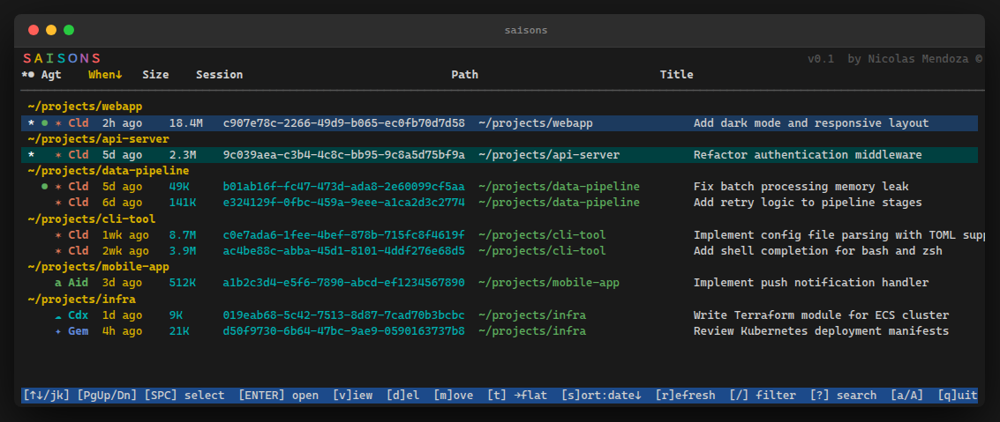

# saisons 

An interactive terminal UI for browsing, resuming, and managing AI coding agent sessions.

Supports [Claude Code](https://claude.ai/code), [Aider](https://aider.chat), [OpenAI Codex CLI](https://github.com/openai/codex), [Gemini CLI](https://github.com/google-gemini/gemini-cli), and [opencode](https://opencode.ai), with an adapter interface for adding more agents.



## Features

- Browse all sessions across all agents and projects
- Agent tag with brand colors (`✶ Cld`, `a Aid`, `☁ Cdx`, `✦ Gem`, `⌬ Opc`)
- Relative timestamps (`2h ago`, `3d ago`) and session size column
- Running session indicators (`●`)
- Sort by any column (`s` ascending, `S` descending)
- Flat or grouped-by-directory view
- Incremental metadata filter (`/`) and full-text search (`?`)
- Multi-select and open multiple sessions as new tabs simultaneously
- Peek at conversation history before opening (`v`)
- Move sessions between directories (`m`)
- Delete sessions (`d`)
- Remembers selection and view mode across restarts
- Auto-detects tmux, screen, gnome-terminal, iTerm2, and Terminal.app

## Install

Requires Perl 5.10+.

### curl (quickest)

Downloads the self-contained fatpacked script — no lib setup needed:

```sh
curl -fsSL https://raw.githubusercontent.com/nicomen/saisons/main/saisons -o ~/.local/bin/saisons
chmod +x ~/.local/bin/saisons
```

Or use the installer which handles PATH setup automatically:

```sh
curl -fsSL https://raw.githubusercontent.com/nicomen/saisons/main/install.sh | sh
```

### cpanm

```sh
cpanm https://github.com/nicomen/saisons/archive/main.tar.gz
```

### From source

```sh
git clone https://github.com/nicomen/saisons.git
cd saisons
perl Makefile.PL && make && make test && make install
```

To rebuild the fatpacked `saisons` script after editing sources:

```sh
make fatpack
```

### macOS

Perl is pre-installed on macOS. The curl method works as-is:

```sh
curl -fsSL https://raw.githubusercontent.com/nicomen/saisons/main/saisons -o ~/.local/bin/saisons
chmod +x ~/.local/bin/saisons
```

Or via the installer:

```sh
curl -fsSL https://raw.githubusercontent.com/nicomen/saisons/main/install.sh | sh
```

Sessions open in iTerm2 (if running inside it) or Terminal.app automatically.

### Windows

```powershell
irm https://raw.githubusercontent.com/nicomen/saisons/main/install.ps1 | iex
```

Installs [Strawberry Perl](https://strawberryperl.com/) via `winget` if needed, then downloads the script and creates a `.cmd` wrapper.

### WSL

Follow the Linux/macOS instructions inside your WSL shell.

## Usage

```sh
saisons
```

### Keys

| Key | Action |
|-----|--------|
| `↑` / `k` | Move cursor up |
| `↓` / `j` | Move cursor down |
| `PgUp` / `PgDn` | Page up / page down |
| `Home` / `g` | Jump to top |
| `End` / `G` | Jump to bottom |
| `Space` | Toggle select |
| `a` / `A` | Select all / deselect all |
| `s` | Sort popup (ascending) |
| `S` | Sort popup (descending) |
| `t` | Toggle flat / group-by-directory view |
| `r` | Refresh running session indicators |
| `Enter` | Open selected sessions (cursor session if none marked) |
| `v` | View conversation history |
| `m` | Move session(s) to a different directory |
| `d` | Delete selected sessions |
| `/` | Incremental filter (title, path, date) |
| `?` | Full-text search (scans session files) |
| `q` / `ESC` | Quit (selection is remembered) |

### Launcher override

```sh
SAISONS_SEARCH_DIRS=~/projects:~/work saisons
CLAUDE_SESSIONS_LAUNCHER=tmux saisons
# launcher options: tmux, screen, gnome-terminal, iterm, terminal-app, inline
```

## Supported agents

| Agent | Sessions stored in | Resume command |
|-------|--------------------|----------------|
| Claude Code | `~/.claude/projects/` | `claude --resume <id>` |
| Aider | `.aider.chat.history.md` per project dir | `aider --restore-chat-history` |
| OpenAI Codex | `~/.codex/sessions/YYYY/MM/DD/` | `codex resume <file>` |
| Gemini CLI | `~/.gemini/tmp/<slug>/chats/` | `gemini --resume <uuid>` |
| opencode | `$XDG_DATA_HOME/opencode/storage/session/` | `opencode --session <id>` |

Aider history files are searched one level deep under `~/projects`, `~/dev`, `~/src`, `~/work`, `~/code`, and `/projects`. Override with `SAISONS_SEARCH_DIRS=dir1:dir2`.

## Adding support for other agents

See [`lib/Saisons/Adapter/HOWTO.md`](lib/Saisons/Adapter/HOWTO.md) for a copy-paste template. In short:

1. Create `lib/Saisons/Adapter/MyAgent.pm` implementing six methods: `name`, `find_sessions`, `running`, `launch`, `delete_session`, `load_messages`
2. Add it to the `@adapters` list in `saisons`
3. Optionally add a brand color entry to `%ADAPTER_TAGS` in `lib/Saisons/UI.pm`

## Session state

`saisons` state (remembered selections, view mode) is stored in `~/.config/saisons/state.json`.
